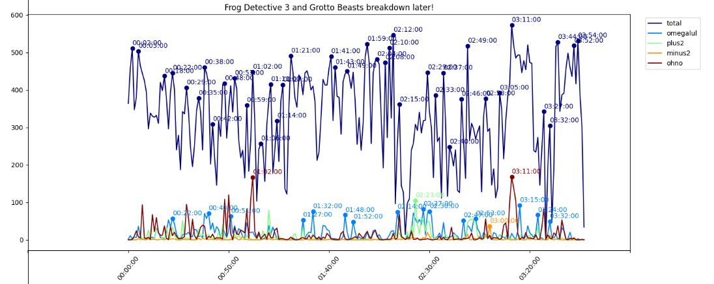
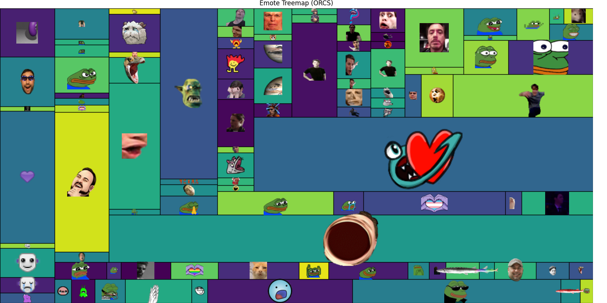
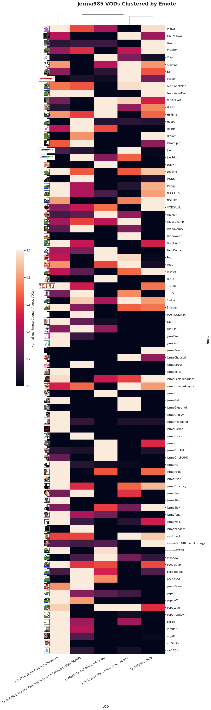

# TwitchChatAnalysis
[](https://github.com/koisland/TwitchChatAnalysis/actions/workflows/pipeline.yaml)

Analyze Twitch chat and produce visuals for VODs from a given channel.

<p float="left">
  
  
  
</p>

> EDA of [Jerma985](https://www.twitch.tv/jerma985) VODs.
>
> From left-to-right:
> * Top chat peaks by custom regex pattern.
> * Emote distribution by VOD.
> * VODs clustered by standardized emote count.


## Getting Started
Requires having a [Twitch Developer](https://dev.twitch.tv/console) application registered and a **client id and secret**.

These should be stored in `.env` file and its path should be specified in `config/config.yaml`.
```bash
TWITCH_CLIENT_ID="?"
TWITCH_CLIENT_SECRET="?"
```

```yaml
setup:
  channel:
    - "jerma985"
  type:
    - "archive"
  paths:
    twitch_cred_file: ".env"
```

### Requirements
Uses `Snakemake` as a workflow manager. To install:
```bash
# With pip.
pip install snakemake

# With conda/mamba
conda install snakemake
```

Pipeline dependencies will be install with `conda` at the start of the pipeline.

## Usage
```bash
snakemake -np -c2 --use-conda
```
