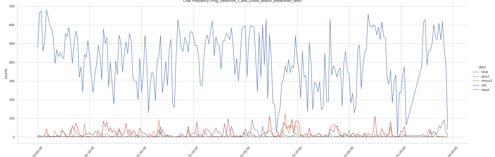

# TwitchChatAnalysis
A pipeline to analyze Twitch chat and produce visuals for VODs from a given channel.


> Frog Detective 3 and Grotto Beasts Stream Chat Frequency

## Getting Started
Requires having a [Twitch Developer](https://dev.twitch.tv/console) application registered and a **client id and secret**.

These should be stored in `.env` file and its path should be specified in `config/config.yaml`.
```bash
TWITCH_CLIENT_ID="?"
TWITCH_CLIENT_SECRET="?"
```

```yaml
setup:
  channel:
    - "jerma985"
  type:
    - "archive"
  paths:
    twitch_cred_file: ".env"
    output_dir: "output"
```

### Requirements
Uses `Snakemake` as a workflow manager. To install:
```bash
# With pip.
pip install snakemake

# With conda/mamba
conda install snakemake
```

Pipeline dependencies will be install with `conda` at the start of the pipeline.

## Usage
```bash
snakemake -np -c2 --use-conda
```
